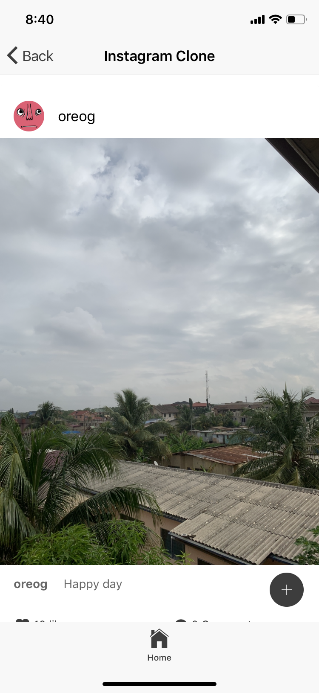
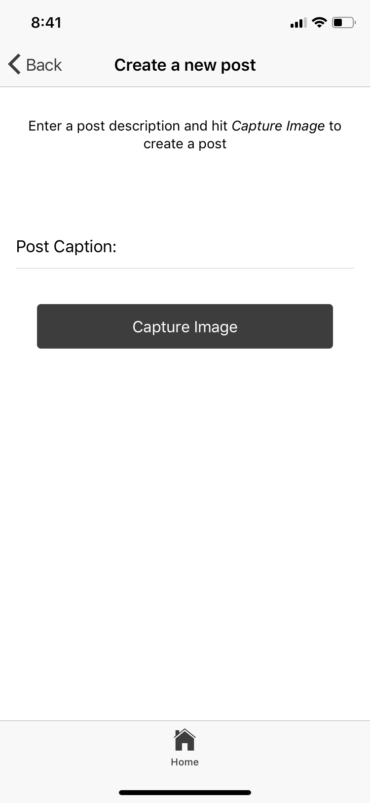
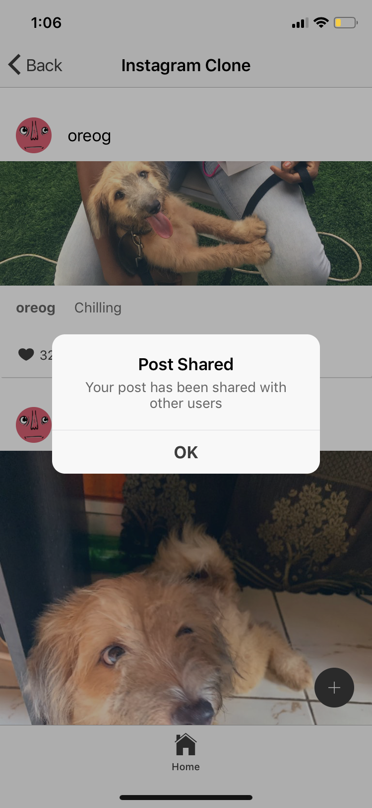
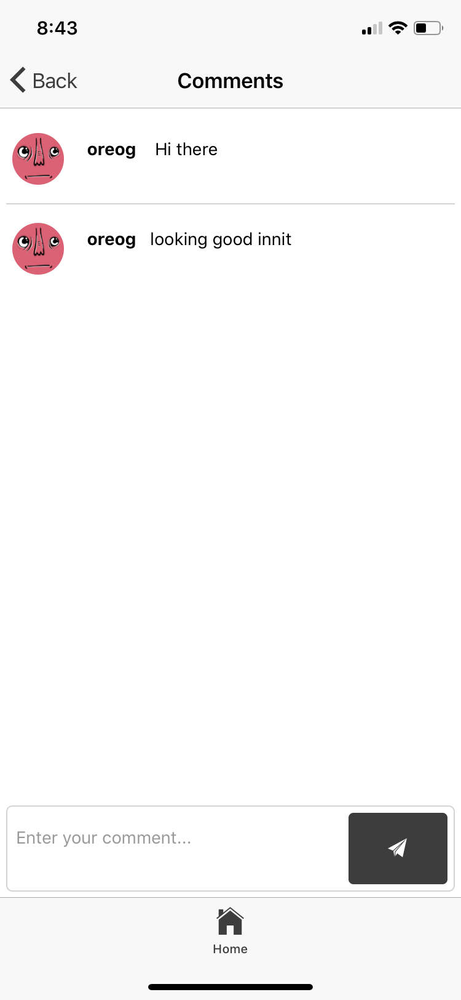

# Ionic Instagram Clone







## Prerequisite
- [Ionic](https://ionicframework.com) installed on your machine, you can read up on how to do that here [] add link
- [NodeJS](https://nodejs.org) installed on your machine
- [Yarn](https://yarnpkg.com) Installed on your machine
- [Dcoker](https://www.docker.com/) Installed on your machine

## Getting Started
- Install the necessary node modules

```bash
npm install
```

- [Obtain Cloudinary Credentials](https://cloudinary.com/signup)

- Enter Cloudinary Credentials in the `src/pages/create-post/create-post.ts`

- [Obtain Pusher Crendtials](https://pusher.com)

- Enter Pusher Credentials in `src/providers/pusher-service/pusher-service.ts` and `server/server.js`


## Setting Up the Backend
- Change Directory and install node modules

```bash
cd server
npm install
```

- Start Backend Server

```bash
node server,js
```

## Update Ionic Application
- Enter Backend Server URLs in `src/pages/create-post/create-post.ts` and `src/pages/comment/comment.ts`

## Create docker server
- In the `server/` directory, create docker container:

```
docker-compose up -d
```

## Start Ionic Application
- Run the command
```bash
ionic serve
```

## Built with
- [Pusher](https://pusher.com) - APIs to allow you add realtime functionality and online presence features to your applications
- [Cloudinary](https://cloudinary.com) - Image and video management full stack platform
- [Prisma](https://prisma.io) - Prisma makes it easy to implement GraphQL servers.
- [Ionic](https://ionicframework.com) - Ionic lets web developers build, test, and deploy cross-platform hybrid mobile apps easier than ever.